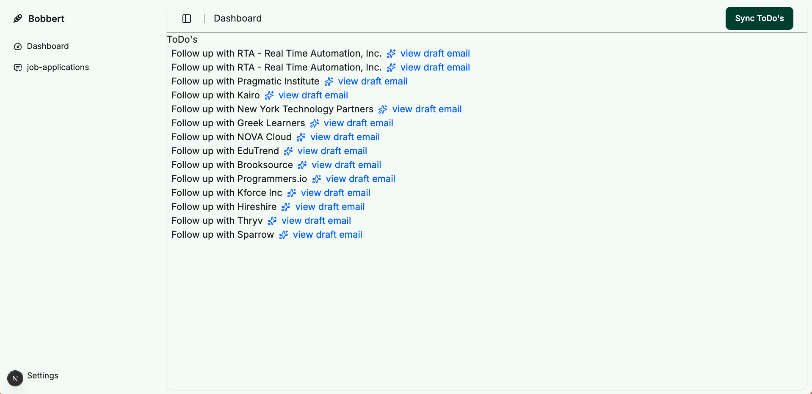
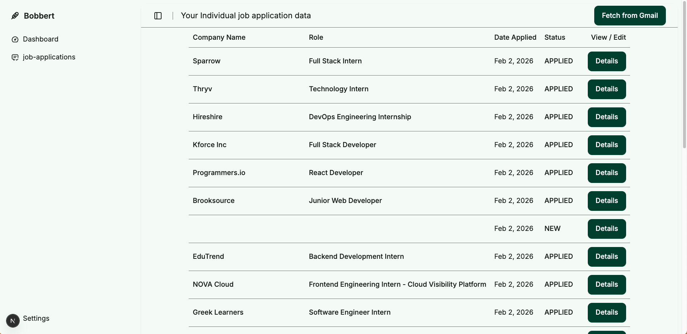
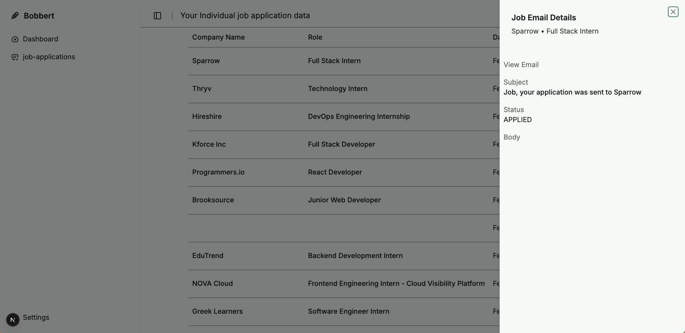

# Bobbert — Job Application Inbox → Pipeline Tracker → Follow-up Drafts
Turn job-related Gmail emails into a clean application pipeline, and generate follow-up drafts when you’re due.  
Built for the **early pipeline**: applying consistently, tracking status, and following up on time.

- ✅ Parse job application emails → normalized `JobEmail` rows
- ✅ Seed “ToDo” follow-ups when `APPLIED` is older than _X_ days
- ✅ One-click draft generation (OpenAI Agent SDK-ready)
- ✅ Minimal UI: ToDo list + Sheet draft viewer + Copy button

> **Goal:** reduce the “did I follow up?” mental overhead and help you keep momentum during the apply phase.

---

## What it looks like

**Dashboard**
  - “Sync ToDo’s” button
  - List of due follow-ups (company / role / applied date)
  - “View draft email” → opens a Sheet with subject/body and Copy



**Job Applications**


**Job Applications: side panel**


---

## How it works

### 1) Ingest Gmail job emails → `JobEmail`
A Gmail poller searches for job-related messages (ex: LinkedIn application confirmations), parses the message, and stores:

- `status` (`NEW`, `APPLIED`, `INTERVIEW`, …)
- `appliedDate`
- `companyName`, `roleTitle`, `location`
- links (`applicationLink`, `externalUrl`, etc.)

### 2) Seed follow-up ToDo rows → `FollowUpDraft` (placeholders)
A “seed” action finds `JobEmail` rows that are:

- `status = APPLIED`
- `appliedDate <= now - X days`
- no existing `FollowUpDraft(DRAFT, EMAIL)` row

It inserts placeholder drafts:

- `subject = null`, `body = null`
- `isGenerated = false`

### 3) Generate the draft on demand
When the user clicks **“view draft email”**:

- server action loads the `JobEmail`
- calls `runFollowUpDraftAgent(...)` (currently deterministic template, later OpenAI Agent SDK)
- updates `FollowUpDraft` with `subject/body`, marks `isGenerated = true`
- UI opens a Sheet with Copy button

---

## Tech stack

- **Next.js** (App Router)
- **TypeScript**
- **Prisma** (Postgres)
- **Prisma Accelerate** (optional extension)
- **Gmail API** (OAuth refresh token)
- **OpenAI** (agent/draft generation)

UI:
- **shadcn/ui** + Radix primitives (Sheet, Button, Input, Textarea)

---

## Data model (high-level)

- `JobEmail` — canonical “application email” record
- `FollowUpDraft` — draft outreach for a `JobEmail` (unique per `jobEmailId + channel + status`)

---

## Project structure

```txt
app/
  (pages)/
    dashboard/
      page.tsx               # server page: loads todos
      FollowUpsList.tsx      # client: renders list + opens Sheet
      FollowUpDraftSheet.tsx # client: Sheet + Copy
      sync-button.tsx        # client: seed todos + router.refresh
  actions/
    followup/
      seed.ts                # seeds FollowUpDraft placeholders
      followups.ts           # getOrGenerateFollowUpEmailDraft

agents/
  followup.agent.ts          # agent entrypoint (SDK-ready)
  generateFollowUpEmailDraft.ts # current deterministic template
  followup.types.ts
  followup.policy.ts
  followup.tools.ts

services/
  gmail.ts                   # poll + parse Gmail emails
  followupDrafts.ts          # seed + query todos + upsert drafts

lib/
  prisma.ts                  # Prisma singleton (+ Accelerate)
  validation/
    JobEmail/...
    FollowUpDraft/...
